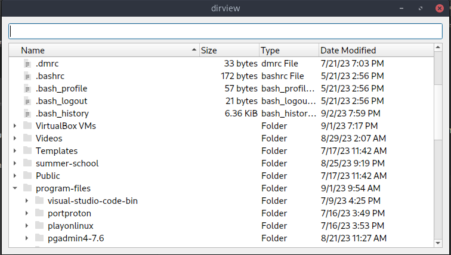

## Порядок выполнения задания  
## 1.  Установить Astra Linux (2.12 или 1.7) на виртуальную машину  
  
#### 1 install virtualbox:  
  
$ sudo pacman -S virtualbox virtualbox-host-modules-arch  
  
#### 2 install Astralinux on virtualbox   
  
open virtualbox, choose astralinux image and choose option "Графическая установка" press button "Продолжить" until system installed  
  
## 2.  Обновиться до последней версии  

В моем случае система везде написала, что не нуждается в обновлении (менеджер пакетов Synaptyc)  
  
$ sudo apt update  
.....  
Все пакеты имеют последние версии  
  
$ sudo apt dist-upgrade  
.....  
Обновлено 0, Установлено 0 ...  

resourse: https://wiki.astralinux.ru/pages/viewpage.action?pageId=212077347  
  
## 3.  Установить из нашего репозитория QtCreator и пакет qtbase5-examples  
  
$ sudo apt install qtcreator qtbase5-examples  
  
## 4.  Открыть проект examples/widgets/itemviews/dirview:  
  
$ cp -r /usr/lib/x86_64-linux-gnu/qt5/examples/widgets/itemviews/dirview/ ~  

## 5.  Сделать стартовой директорией домашнюю директорию текущего пользователя. То есть того пользователя, что запускает утилиту  
  
QTreeView::setRootIndex(QDir::cleanPath(QDir::homePath()))  
  
## 6.  Отображать файлы, папки, в том числе и скрытые  
  
QFileSystem::setFilter(QDir::AllEntries | QDir::Hidden)  
  
## 7.  Добавить QLineEdit виджет, который использовать для фильтрации по именам файлов и папок  
  
Написал класс, который делает то же, что пример, добавил QLineEdit в него, мне было проще и привычнее так, если необходимо оставить пример таким, каким он был - могу переделать  

